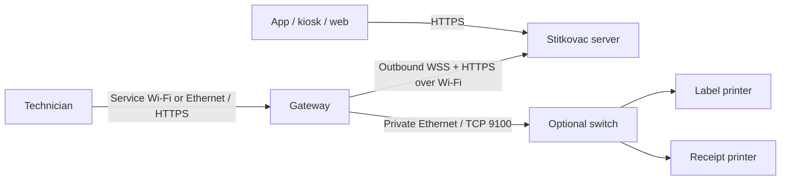

# Specifikace Štítkovač Gateway

Datum: 2026-09-29. Stav: návrh pro implementaci, nikoli popis hotové funkce.

První implementace a její omezení jsou v [přehledu stavu](implementation-status.md).
Rozhodnutí o náhradě původně navrženého dnsmasq popisuje [ADR 001](adr-001-dhcp.md).

## 1. Účel a rozsah

U zákazníka síť izoluje jednotlivá zařízení. Tablet ani cloudový server proto
nedosáhne na ethernetovou tiskárnu. Brána má vlastní odchozí spojení do cloudu
přes zákazníkovu Wi-Fi a přímé ethernetové spojení k jedné nebo více tiskárnám.
Tablet komunikuje pouze se serverem a tisk nevyžaduje jeho spojení s bránou.

### Potvrzené požadavky

- Podporovat štítky i účtenky, následně všechny stávající druhy tiskových úloh.
- Honeywell PC42E spolehlivě tiskne PDF ze Štítkovače v lokální síti; potvrdil provozovatel.
- Nízká latence, trvalé spojení se serverem, bez periodického dotazování brány na nové úlohy.
- Jedna brána obslouží více tiskáren; více bran může patřit jedné organizaci.
- Tiskárny používají DHCP; první přidělená adresa se automaticky stane trvalou
  rezervací podle MAC adresy, bez ručního nastavení IP v tiskárně.
- Brány mohou používat různí oprávnění uživatelé; zákazníci zůstávají izolovaní.
- Dlouhodobé přihlašovací údaje brány, bez každodenního přihlášení zaměstnance.
- Lokální web chráněný heslem pro technika: Wi-Fi, tiskárny, stav a diagnostika.
- Superadmin vidí všechny brány napříč systémem a jejich provozní informace.
- Zařízení připravuje a instaluje primárně provozovatel Štítkovače.
- Vycházet z existující linuxové distribuce pro Raspberry Pi a použít Ansible.
- Připravit cestu k opakovatelné instalaci a instalačnímu balíčku.
- Běžný způsob vypnutí je odpojení napájení společně s tiskárnou, bez graceful
  shutdown. Po zapnutí se brána sama obnoví; bezpečnost nesmí záviset na shutdown hooku.
- Chyby se centrálně evidují v Rollbaru (`rollbar.com`).

### Doporučená rozhodnutí tohoto návrhu

Výchozí hardware je Raspberry Pi 3 B+, systém Raspberry Pi OS Lite 64-bit.
Agent bude napsaný v Go s jednoduchým vloženým webovým rozhraním, lokální databází
SQLite a službou `systemd`. Jde o doporučení pro implementaci; konkrétní verze
OS, knihoven a hardwarová sestava musí projít pilotním ověřením.

První verze podporuje Wi-Fi s WPA2-Personal a ethernetový RAW tisk na TCP 9100.
WPA3-only, WPA-Enterprise, captive portal, USB tisk a univerzální tiskové ovladače
nejsou součástí první verze. Síť zákazníka musí umožnit DNS, synchronizaci času
a odchozí HTTPS/WSS na doménu serveru. Samotná izolace Wi-Fi klientů tomu nevadí.

## 2. Architektura a odpovědnosti

WSS navazuje brána; server následně může posílat události po již otevřeném spojení.
Nejde o L2 bridge, router ani VPN. Mezi zákazníkovou Wi-Fi a sítí tiskáren nebude
zapnuté směrování, NAT ani přeposílání paketů. Porty u zákazníka se neotevírají.

| Součást | Odpovědnost |
|---|---|
| Server | Oprávnění, výběr tiskárny, render dokumentu, trvalá fronta, přiřazení bráně, audit |
| Agent | Spojení s cloudem, převzetí úloh, lokální evidence, odeslání bajtů a hlášení výsledku |
| Lokální web | Servisní přihlášení, síťové nastavení, diagnostika a správa lokálních připojení |
| Privilegovaný pomocník | Úzce vymezené změny sítě a servisního režimu |
| Ansible | Instalace OS konfigurace a aplikace, služby, oprávnění, firewall, aktualizace |
| Tiskárna | Interpretace dokumentu a fyzický tisk |

Server zůstává autoritou pro ceny, DPH, číslování, šablony a účtování. Brána PDF
nerenderuje ani nemění. U pokladní zásuvky předá serverem připravené binární bajty;
podpora zásuvky závisí na konkrétní účtenkové tiskárně, nikoli na PC42E.

## 3. Hardware a základní systém

- Raspberry Pi 3 B+: integrovaný ethernet, Wi-Fi 2,4/5 GHz, 1 GB RAM.
- Kvalitní odpovídající zdroj, microSD alespoň 16 GB, přednostně endurance,
  krabička vhodná do provozu, ethernetový kabel.
- Pro více tiskáren samostatný neřízený switch; jejich síť se nepřipojuje do LAN zákazníka.
- Raspberry Pi OS Lite 64-bit bez grafického desktopu a bez Dockeru v první verzi.
- Systémový a boot oddíl v běžném provozu read-only, samostatný trvalý datový
  oddíl; podrobnosti a omezení odolnosti proti odpojení napájení jsou níže.
- Vydání OS a kontrolní součet instalačního obrazu budou zaznamenány v release manifestu.
- Přesný rozpočet a dostupnost se ověří před nákupem; Pi 3 B+ je doporučení, ne již pořízený hardware.
- Go agent má běžet i na jiném kompatibilním ARM64 Linuxu; provisioning a servisní AP
  jsou testované pouze pro výslovně podporované modely a síťové adaptéry.

Výkon stačí posoudit měřením lehkého agenta, webu a fronty; neinstalovat na bránu
backend Štítkovače, MariaDB ani renderovací stack. Zero 2 W je případná pozdější
levnější varianta, ale potřebuje ethernetový adaptér a nemá 5GHz Wi-Fi.

### Provoz bez korektního vypnutí

Odpojení napájení je očekávaná provozní událost. Brána nesmí vyžadovat tlačítko
„Vypnout“, přihlášení technika ani dokončení odeslání logů. Po obnovení napájení
automaticky nastartuje a obnoví konfiguraci, DHCP, cloudové spojení a evidenci
úloh. Přerušený fyzický tisk nelze zaručit dokončit ani automaticky opakovat.

| Úložiště | Režim a obsah |
|---|---|
| Boot a systém | Read-only v běžném provozu; případný OverlayFS má dočasnou horní vrstvu v RAM |
| `/data` | Samostatný zapisovatelný ext4 oddíl s journalingem; trvalý stav, konfigurace a aplikační releases |
| `/run`, `/tmp`, běžný journal | RAM s limity velikosti; ztráta po vypnutí je přijatelná |
| Kritická evidence | SQLite na `/data`, WAL a `synchronous=FULL`; žádné odložené uložení až při shutdownu |

Samotné zapnutí OverlayFS nestačí: změny v jeho RAM vrstvě se při vypnutí ztratí.
Ansible připraví oddíly a mounty před instalací do provozu. Wi-Fi profily, známá
funkční síťová konfigurace, identita brány, přístupy, TLS/SSH klíče, DHCP rezervace
i leases, tisková evidence a dokumenty musí mít explicitní trvalé umístění na
`/data`. Potřebné systémové cesty se připojí pomocí bind mountů před startem
NetworkManageru a dalších služeb. Swap na microSD bude vypnutý.

Potvrzení „Uloženo“ v lokálním webu smí přijít až po trvalém commitu. U souborů
se používá zápis do dočasného souboru na stejném filesystemu, `fsync` souboru,
atomický rename a `fsync` rodičovského adresáře; samotný rename negarantuje
uložení při výpadku. Vícesouborové změny mají verzovaný manifest a návrat na
poslední kompletní konfiguraci. Generované soubory lze obnovit z trvalé autority.
Pád během změny Wi-Fi nesmí zničit poslední známý funkční profil.

Tiskové přechody se ukládají synchronně před nevratnou akcí. Běžné logy a
telemetrie se mohou dávkovat, ale `SENDING`, `SENT`, identita a rezervace nikoli.
SQLite recovery potřebuje související WAL soubory; po restartu se nesmějí mazat
ve snaze o „opravu“. Zálohování běžící databáze používá podporovaný SQLite
backup postup, nikoli kopii samotného hlavního souboru bez WAL.

### Pořadí obnovy po zapnutí

1. Připojit systém a datový oddíl, provést standardní filesystem recovery.
2. Otevřít a zkontrolovat SQLite, dokončit nebo vrátit nekompletní změny konfigurace.
3. Obnovit síťové profily a DHCP rezervace; teprve potom povolit přidělování adres.
4. Spustit lokální web a navázat uplink, synchronizovat čas a připojit WSS.
5. Sjednotit stav tiskových pokusů se serverem: uložené `SENT` pouze potvrdit,
   nedokončené `SENDING` řešit jako `UNKNOWN`, nikdy slepě znovu vytisknout.
6. Počkat na připravenost tiskárny. Po společném zapnutí může startovat déle než
   brána; neúspěšné spojení před odesláním bajtů se bezpečně opakuje v rámci expirace.

Služby spravuje `systemd` s automatickým restartem a omezením restartovacích
smyček. Agent má watchdog; použití hardwarového watchdogu se ověří na cílovém
modelu. Samotný reset watchdogem musí být bezpečný stejně jako odpojení napájení.
Chybějící `/data` nesmí vést ke startu nad prázdným adresářem v RAM ani k nové
identitě. Nouzová lokální stránka může ukázat poruchu bez tisku a přidělování DHCP;
vyžaduje platné servisní ověření, jinak jen fyzický servis bez zpřístupnění dat.

Při poškození evidence se nevytváří automaticky prázdná databáze a nespouští
staré úlohy. Dostupná konfigurace se zachová, tisk se zablokuje a vyžádá servis.
Pokud nelze načíst přístupové údaje, může být centrálně viditelný pouze offline
stav; Rollbar nemůže nahradit zařízení, které nenastartovalo nebo nemá spojení.

Read-only systém, journaling a trvalé commity výrazně omezují riziko, ale
negarantují ochranu proti selhání řadiče nebo fyzickému poškození microSD.
Endurance karta zlepšuje životnost, není automaticky power-loss protected.
První verze nevyžaduje UPS; absolutní hardwarová garance by vyžadovala ověřené
úložiště s ochranou při výpadku nebo zálohované napájení. Odolnost sestavy se
musí prokázat opakovaným fyzickým odpojováním napájení, nikoli jen ukončením procesu.

## 4. Síť a instalace u zákazníka

### Oddělení rozhraní

Zákazníkova Wi-Fi je uplink, získává IP přes DHCP a poskytuje výchozí trasu a DNS.
Ethernet má samostatný privátní subnet a pevnou adresu brány; nemá výchozí trasu.
Názvy rozhraní se detekují nebo nastavují v inventory, nespoléhat na `eth0` a `wlan0`.

Výchozí návrh subnetů: tiskárny `192.168.77.0/24`, brána `192.168.77.1`;
servisní AP `192.168.78.0/24`, brána `192.168.78.1`. Jde o konfigurovatelné výchozí
hodnoty. Při kolizi s uplinkem web vyžádá změnu před aktivací konfigurace.

### DHCP a automatické trvalé rezervace

Brána provozuje vlastní DHCPv4 server pro ethernetovou síť tiskáren. Tiskárny
zůstávají v režimu DHCP: „statická lease“ znamená trvalou rezervaci MAC → IP
na bráně, nikoli přepnutí tiskárny na ručně nastavenou IP. Doba jednotlivé lease
zůstává konečná, navrženě 24 hodin; rezervace sama neexpiruje.

Výchozí pool je `192.168.77.50–192.168.77.199`. Adresa brány, síťová a broadcast
adresa jsou vyloučené. Rozsah mimo pool slouží případným ručním servisním adresám;
web nedovolí jeho překryv s rezervacemi. DHCP nepředává tiskárnám výchozí trasu
ani DNS, protože tato síť neposkytuje internet. Servisní notebook může na ethernetu
získat adresu automaticky; přístup k lokálnímu webu funguje přes IP brány.

Postup přidělení a rezervace:

1. DHCP služba vybere novému zařízení volnou adresu a trvale uloží rezervaci
   normalizované MAC/IP ještě před odesláním OFFER.
2. Před ACK se trvale uloží také aktivní lease. Selhání commitu znamená, že
   úspěšná odpověď klientovi neodejde. Rezervace tedy vzniká už při nabídce.
3. Tato adresa zůstává rezervovaná pouze pro danou MAC. Při obnově lease,
   restartu nebo dlouhém odpojení dostane zařízení stejnou adresu.
4. Změna hostname či DHCP client identifier nesmí pro stejnou MAC vytvořit novou
   adresu. U MAC rezervací se ignoruje DHCP client identifier.
5. DHCP RELEASE, expirace lease ani odpojení zařízení rezervaci nesmažou.
   Uvolnit ji může pouze technik výslovnou akcí.

DHCP samo spolehlivě nepozná tiskárnu. Pravidlo proto platí pro všechna zařízení
v ethernetovém poolu, včetně servisního notebooku. Přidělení adresy není oprávnění
k tisku: technik nalezené zařízení označí jako tiskárnu a přiřadí mu endpoint.
Klienti dočasného servisního AP tuto automatickou trvalou rezervaci nedostávají.

Původně zvažovaný dnsmasq s asynchronním lease hookem nahrazuje integrovaná
DHCPv4 služba, která přímo používá trvalou evidenci agenta. SQLite transakce
zaručuje pořadí commit před odpovědí; lease a rezervace nejsou dvě oddělené kopie
stavu. Podrobnosti a podporované DHCP zprávy uvádí [ADR 001](adr-001-dhcp.md).

Správce rezervací zapisuje změny sériově, s unikátností MAC i IP v daném subnetu.
Služba začne odpovídat teprve po otevření a ověření databáze. Při nečitelném
nebo rozporném stavu se nové adresy nepřidělují. Software neposílá ACK před
commitem; skutečnou trvalost commitu na konkrétní SD kartě stále musí ověřit
fyzické power-cut testy. Tuto podmínku nelze nahradit unit testem nebo shutdown hookem.

Připojená tiskárna se zpřístupní pro tisk až po úspěšném uložení a aktivaci
rezervace. Při zaplnění poolu se staré rezervace automaticky nerecyklují.
Smazání vyžaduje odpojené zařízení, vyřešení aktivní lease a kontrolu vazeb na
tiskárnu i nevyřízené úlohy. Změna subnetu je řízená migrace rezervací při
pozastaveném tisku; nové adresy musí tiskárny získat obnovou DHCP před obnovením provozu.

DHCP služby jsou svázané pouze se svými rozhraními a subnety: ethernetová instance
pro tiskárny, oddělená služba pro servisní AP. Nesmějí odpovídat na zákaznickém
Wi-Fi uplinku ani soupeřit s automaticky spuštěným DHCP serverem NetworkManageru.
Ethernet nepoužívá režim sdílení připojení, který by přidal NAT a další DHCP server.

### První spuštění a změna Wi-Fi

1. Technik nahraje ověřený Raspberry Pi OS Lite a v přípravné síti spustí Ansible.
   Čistý OS ještě žádný gateway web ani servisní AP nemá.
2. Provisioning nainstaluje agenta, vytvoří unikátní identitu a servisní přístupy.
3. Nepřipravená brána nabídne zaheslované AP `Stitkovac-GW-<short-id>`.
4. Technik se připojí a přihlásí do lokálního webu. Web umí vyhledat SSID,
   zadat skryté SSID, heslo a zemi provozu rádiového modulu.
5. Uložení spustí řízený pokus o připojení. Web předem oznámí zánik servisního AP.
6. Ověří se asociace, přidělení IP, DNS a TLS dostupnost serveru. Stav přihlášení
   brány je samostatný; chybějící token není chyba Wi-Fi.
7. Při chybném hesle nebo neúspěšném síťovém nastavení do 90 sekund se obnoví
   předchozí funkční profil; není-li použitelný, vrátí se servisní AP.
8. Technik spáruje bránu, připojí tiskárny v režimu DHCP, vybere je ze seznamu
   automaticky rezervovaných zařízení, přiřadí je v serveru a provede testovací tisk.

Jedno Wi-Fi rádio v první verzi střídá klientský a servisní režim. Souběh AP a
uplinku není předpoklad řešení. AP se automaticky aktivuje při prvotním nastavení
nebo selhání právě prováděné konfigurace. Běžný výpadek internetu nespouští trvalé
přepínání do AP; agent pokračuje v obnově uplinku.

Servisní AP již funkční brány lze zapnout dlouhým stiskem samostatného GPIO
tlačítka nebo z webu při ethernetovém připojení. Tlačítko není vestavěnou funkcí
Pi 3 B+; jeho zapojení je součástí budoucího instalačního návodu. AP má časový
limit, například 15 minut nečinnosti, a při jeho spuštění je cloudové spojení offline.

## 5. Lokální administrační web

Rozhraní je v češtině, funguje bez internetu a je použitelné z notebooku i telefonu.
Přístup přes servisní AP nebo ethernet musí fungovat i při izolaci zákaznické Wi-Fi.
Standardně web ani SSH neposlouchají na zákaznickém Wi-Fi rozhraní.

### Obrazovky

| Obrazovka | Obsah a akce |
|---|---|
| Přehled | Název/ID, organizace, uptime, verze, čas, disk, uplink, cloudové spojení, fronta |
| Síť | SSID, signál, IP, DNS, změna Wi-Fi, ethernetový subnet a DHCP pool, rezervace, servisní AP |
| Tiskárny | Název, lokální ID, MAC, rezervovaná IP/port, stav lease, přiřazení serverové tiskárně, poslední kontrola a chyba |
| Tiskové úlohy | Časy a stavy, tiskárna, bezpečný retry, nejistý výsledek a jeho vysvětlení |
| Diagnostika | Oddělený test Wi-Fi, DNS, TLS/WSS a TCP tiskárny; očištěný export logů |
| Správa | Párování, změna servisního hesla, informace o aktualizaci, řízený restart |

Zařízení se ve webu objeví z DHCP událostí včetně MAC, přidělené IP, hostname,
platnosti lease a stavu trvalé rezervace. Technik vybere tiskárnu, zadá název
a případně port; IP se převezme z rezervace. Hostname je nedůvěryhodný vstup
a musí se bezpečně zobrazovat. Přiřazení tiskárny nepotřebuje síťový scan.
Aktivní lease ani TCP port nedokazují přítomnost papíru. Web rozlišuje rezervovanou
adresu, aktivní lease, síťově dostupný endpoint a skutečně potvrzený tisk.

Lokální test spojení funguje offline. Zkušební tisk první verze vyžaduje server,
který vytvoří `TEST_PAGE` běžnou tiskovou cestou. Nejde o novou účtenku ani prodej.
Stav papíru a krytu bude zobrazen jen tehdy, pokud jej konkrétní ověřený protokol
tiskárny umí hlásit; jinak se uvádí „Nezjištěno“.

### Přístup a oprávnění

- Každá brána má unikátní servisní heslo známé technikovi, oddělené od hesla AP
  i cloudového tokenu. Hash hesla je uložen pomocí Argon2id; plaintext se neuchovává.
- Lokální HTTPS používá při provisioningu vytvořený unikátní certifikát.
  Technik ověří fingerprint nebo použije předem důvěryhodnou servisní CA.
  Soukromý klíč CA se na brány neinstaluje; nepočítá se s veřejným ACME pro offline síť.
- Přihlašovací session má omezenou životnost, Secure/HttpOnly/SameSite cookies,
  ochranu CSRF, omezení pokusů o přihlášení a validaci Host/Origin.
- Agent běží jako neprivilegovaný uživatel. Změny sítě provádí malý pomocník přes
  lokální socket s kontrolou volajícího a explicitním seznamem povolených operací.
- Web neposkytuje shell, obecný příkaz ani nahrávání spustitelných skriptů.
- Hesla Wi-Fi spravuje NetworkManager; jsou přístupná pouze potřebným systémovým
  procesům. Nevracejí se do browseru, telemetrie ani exportu logů.

## 6. Identita, párování a více zákazníků

Brána má trvalé náhodné `gatewayId`, vlastní token a patří právě jedné organizaci.
Vazba na uživatele existuje jako audit registrace; odchod nebo odhlášení zaměstnance
nesmí bránu odstavit. Organizace může mít více bran a uživatelé tisknou podle svých
stávajících oprávnění. Jedna brána nesdílí tiskové fronty více organizací.

Superadmin vytvoří registraci pro konkrétní organizaci a získá jednorázový párovací
kód s krátkou platností, navrženě 10 minut. Technik jej vloží do lokálního webu.
Brána přes HTTPS obdrží dlouhodobý náhodný token platný do odvolání; token se
ukládá lokálně s omezenými právy a na serveru jen jako hash. Párovací endpoint
má vlastní rate limit a neslouží jako běžné uživatelské přihlášení.

Token opravňuje jen ke gateway API a přiřazeným úlohám: vlastní konfigurace,
claim, download, výsledek a telemetrie. Neposkytuje přístup k uživatelům, prodejům
ani k jiným branám. Server identitu a organizaci odvozuje z tokenu, nikoli z
klientem zaslaných ID. Token nesmí být v URL, logu ani WebSocket query stringu.

Odvolání tokenu ukončí aktivní spojení a zakáže další přístup. Rotace podporuje
krátký překryv starého a nového tokenu s potvrzením uložení. Změna organizace vyžaduje
odpojení, vyřešení starých úloh, smazání lokálních dokumentů a nové párování.
Klonovaný image nesmí obsahovat `gatewayId`, tokeny, hesla, certifikáty ani SSH klíče;
každá instalace je vygeneruje samostatně.

## 7. Tiskárny a vazby na server

Každá logická tiskárna na serveru má nejvýše jednu aktivní bránu a jeden lokální
endpoint. Brána může mít více endpointů. Žádný automatický failover téhož fyzického
zařízení mezi branami v první verzi nebude.

Lokální správce rezervací je autorita pro MAC/IP, web pro port a lokální
identifikátor připojení. Server je
autorita pro příslušnost organizaci, oprávnění, přiřazení logické tiskárny a její
výběr při tisku. Agent synchronizuje verzovaný seznam endpointů; server vede jeho
potvrzenou kopii. Lokální změna offline je označena jako čekající na synchronizaci.

Při vytvoření úlohy server uloží snapshot `gatewayId`, lokálního endpointu,
verze konfigurace, očekávané MAC, cílové IP/portu a logické tiskárny. Změna adresy nesmí starou
úlohu potichu přesměrovat. Agent při rozporu snapshotu a aktuální konfigurace
pozastaví tisk do rozhodnutí technika. Přesměrování vytváří auditovaný nový pokus
a je dovoleno jen po vyřešení původního pokusu.

Před tiskem agent ověří shodu rezervace s očekávanou MAC a podle dostupné
sousedské tabulky také to, že adresu neobsadilo jiné zařízení. Při konfliktu
pozastaví endpoint. MAC je síťový identifikátor, nikoli kryptografický důkaz identity.
Výměna tiskárny s jinou MAC vytvoří novou rezervaci; převod jejího logického
přiřazení je explicitní servisní akce po vyřešení původních úloh. Samotné obsazení
staré IP nesmí nové tiskárně zpřístupnit staré dokumenty.

Agent povolí tisk pouze na nakonfigurované endpointy v privátním ethernetovém
subnetu, v první verzi na TCP 9100. Odmítne loopback, multicast, broadcast,
adresy samotné brány a cesty přes Wi-Fi. Síťová politika nesmí vytvořit obecnou
proxy do zákazníkovy LAN. Dvě logické tiskárny se stejným IP/portem sdílí jednu
frontu pro fyzický endpoint; nesmějí zapisovat současně.

## 8. Protokol a doručování bez pollingu

### Spojení

Agent otevírá WSS na server přes port 443 s Bearer tokenem v hlavičce. Ověřuje
TLS certifikát a hostname. Protokol má vlastní verzi a handshake s verzí agenta,
schopnostmi a generací session. První verze používá malé JSON zprávy; dokumenty
se stahují přes HTTPS po události, nikoli jako base64 ve WebSocketu.

Navržené zprávy: `hello`, `ready`, `jobs.available`, `config.changed`,
`status.report`, `command.request`, `command.result`. Každá má `messageId`,
verzi a korelační ID; příkaz má navíc expiraci. Seznam příkazů je uzavřený.

- Heartbeat navrženě po 20 sekundách, offline stav nejpozději po 60 sekundách.
- Reconnect s exponenciálním backoffem a jitterem, od 1 do nejvýše 30 sekund.
- Po připojení brána jednorázově synchronizuje nedokončené úlohy a potvrzení.
- Opakovaná událost znamená opakované zjištění stavu, nikdy automatický nový tisk.
- Aktivní session je jedna na bránu. Nová session zneplatní starou pro claim/start;
  rozpracovaný pokus se nepředá jinému procesu. Agent má také lokální procesní zámek.
- Cloudflare a serverové restarty mohou spojení přerušit; reconnect je standardní stav.

Heartbeat, stavová telemetrie a retry neúspěšného konkrétního requestu nejsou
periodické dotazování na nové úlohy. Brána nevykonává časovač `GET pending jobs`.

### Odolnost proti ztrátě události

Tisková úloha a záznam k odeslání události vznikají v jedné databázové transakci
na serveru (transactional outbox). Událost se publikuje až po commitu. Serverový
dispatcher zpracovává trvalý outbox a opakuje nepotvrzené doručení. Pád mezi
commitem a odesláním ani ztracená notifikace na živém spojení nesmí úlohu zablokovat.
Případný interní interval dispatcheru není polling ze zařízení; běžná cesta se
probudí ihned po commitu a interval slouží k obnově neodeslaných záznamů.

Při více instancích serveru musí událost dorazit instanci držící WSS session.
Nelze spoléhat jen na lokální Spring event. Implementace musí buď zajistit
sdílené doručování a registr vlastníků session, nebo explicitně omezit gateway
endpoint na jednu aktivní instanci s obnovou z databáze po restartu.

### Zpracování úlohy

1. Server uloží dokument, cílový snapshot, pořadí a oznámí dostupnost práce.
2. Brána načte příslušnou frontu stránkovanou stabilním kurzorem. Pořadí je
   serverové a monotónní pro fyzickou tiskárnu, nikoli podle pořadí WSS zpráv.
3. Atomický claim přiřadí úlohu autentizované bráně a konkrétnímu `attemptId`.
4. Brána stáhne dokument, ověří délku a SHA-256 a uloží jej lokálně.
5. Před jakýmkoli zápisem do socketu si vyžádá idempotentní povolení startu
   pokusu a trvale zaznamená stav `SENDING` v lokální databázi.
6. Dokument odešle beze změny, s timeouty a bez paralelního zápisu na stejný endpoint.
7. Výsledek nejprve trvale uloží lokálně a následně potvrdí serveru.
8. Potvrzení serveru umožní odstranit lokální dokument; evidence pokusu zůstane
   po dohodnutou dobu pro deduplikaci.

Události i požadavky mohou přijít vícekrát. Claim, start a výsledky jsou idempotentní
pro dvojici `jobUid` + `attemptId` a kontrolují session/oprávnění. Při opakování
výsledku s jiným obsahem server vrátí konflikt, nikoli úspěch přepsání historie.

## 9. Stavy, výpadky a ochrana proti dvojímu tisku

RAW TCP tisk neposkytuje transakci mezi tiskárnou a evidencí. Nelze garantovat
exactly-once fyzický tisk. `SENT` znamená dokončený zápis dokumentu do TCP spojení,
nikoli potvrzení papíru. V UI se zobrazí „Odesláno tiskárně“.

| Stav pokusu | Význam a pravidlo obnovy |
|---|---|
| `PENDING` | Čeká na bránu; nic nebylo předáno k odeslání |
| `CLAIMED` | Stažení/příprava; lze bezpečně obnovit, pokud start nebyl povolen |
| `SENDING` | Start povolen; data mohla opustit bránu; žádné automatické přidělení jinému pokusu |
| `SENT` | Celý zápis dokončen a výsledek trvale zaznamenán; opakuje se jen potvrzení |
| `FAILED` | Prokazatelně selhalo před prvním možným zápisem; lze nabídnout bezpečný retry |
| `UNKNOWN` | Částečný zápis, timeout při zápisu nebo pád bez trvalého výsledku; nutná kontrola obsluhou |
| `CANCELLED` | Zrušeno před povolením startu; již nesmí být spuštěno |
| `EXPIRED` | Vypršela povolená doba před startem; vyžaduje nové rozhodnutí |

Server může po ztrátě brány označit neuzavřený `SENDING` jako `UNKNOWN`, ale
nezpřístupní tím automaticky další tisk. Pozdější doložené `SENT` stejného pokusu
může nejistotu vyřešit, pokud ještě nebyl ručně uzavřen. Staré výsledky nikdy
nepřepisují nový pokus.

- Pád po lokálně uloženém `SENT`, ale před ACK: po restartu poslat jen výsledek.
- Pád ve stavu `SENDING`, včetně okamžiku před skutečným zápisem: konzervativně `UNKNOWN`.
- Odmítnuté TCP spojení před zápisem: bezpečný retry s omezeným backoffem.
- Ztráta internetu před povolením startu: novou úlohu nespouštět.
- Ztráta internetu po povolení startu: právě zahájený pokus lze dokončit a uložit
  výsledek; další úlohy čekají na spojení. Odvolání tokenu nezastaví již odeslané bajty.
- Restart nebo aktualizace: zastavit přijímání práce, dokončit aktivní přenosy,
  uložit výsledky. Při vynuceném přerušení zaznamenat nejistý výsledek, pokud je
  to možné. Po náhlém odpojení napájení se nejistota určí až při obnově z již
  uloženého `SENDING`; žádný závěrečný zápis při vypnutí se nepředpokládá.
- Chyba jedné tiskárny neblokuje ostatní. `UNKNOWN` pozastaví frontu daného
  endpointu, dokud obsluha nevyřeší stav i případný částečný dokument v tiskárně.
- Ruční opakování nejisté úlohy vyžaduje kontrolu původní brány/tiskárny a
  zamezení pokračování starého procesu. Pouhé vypršení lease není důkaz zastavení.
- Opakovaný tisk vytvoří nový pokus nebo novou úlohu s vazbou na originál,
  nikoli nový prodej. Akce je auditovaná a upozorní na možné duplicity.

Úloha má `expiresAt`; navržená výchozí platnost pro automatické zahájení je
5 minut. Starší dokument se po návratu sítě automaticky neroztiskne. Doklad na
serveru zůstává platný a oprávněná obsluha může požádat o nový tisk. Puls pokladní
zásuvky má krátkou platnost, navrženě 15 sekund, a automaticky se neopakuje po
nejistém výsledku. Tisk účtenky a puls jsou samostatné úlohy s explicitní závislostí
a pořadím; selhání pulsu není selháním prodeje.

SQLite uchovává úlohy/pokusy s trvalými commity před zápisem na tiskárnu,
WAL se `synchronous=FULL` na datovém oddílu. Dokumenty a stav jsou dostupné jen servisnímu účtu.
Po potvrzeném výsledku se dokumenty mažou, očištěná metadata se drží navrženě
30 dní. Nevyřešené dokumenty nejvýše 7 dní; tombstone a stav nejistoty zůstávají.
Po ztrátě lokální databáze se dříve zahájené úlohy automaticky netisknou.
Plný disk zastaví nové starty před tiskem a vyvolá stav vyžadující zásah.

## 10. Změny v existujícím serveru a kompatibilita

Současný server již obsahuje `PrintJobService`, `PrintJobController`, uložené
dokumenty, atomický claim a potvrzení výsledku pro `LOCALNET`. Tento návrh na ně
navazuje, ale jejich aktuální kontrakt není pro brány dostatečný.

Potřebné rozšíření:

- Evidence `GATEWAY`, tokenů, registrací, endpointů, posledního kontaktu a auditu.
- Nový režim tiskárny `GATEWAY` vedle `RAW`, `FILE` a `LOCALNET`.
- Gateway dispatch metadata, stav pokusu a `attemptId`; snapshot přiřazení brány.
- Outbox, WSS endpoint, gateway autentizace a vynucení oprávnění při každé operaci.
- Kontrola vlastníka také u downloadu a výsledku. Aktuální uživatelský `deviceId`
  je klientem zaslaný text, ne identita, které smí gateway autorizace důvěřovat.
- Oddělené gateway API s verzí, například `/api/gateway/v1/...`; konkrétní DTO
  a endpointy se zveřejní jako OpenAPI a popis WSS zpráv před implementací klienta.
- Superadmin přehled v existujícím serverovém webui, nikoli v lokálním webu brány.
- Autentizovaný příjem chybových událostí z bran a jejich asynchronní předání do Rollbaru.

Současný `PrintJobStatus` obsahuje `PENDING`, `CLAIMED`, `PRINTED`, `FAILED`.
Nové podrobné gateway stavy nesmějí rozbít jeho staré konzumenty. Preferovat
vlastní verzovaný stav pokusu a explicitní mapování pro společný administrativní
přehled; `SENT` se nesmí v novém UI vydávat za potvrzený fyzický tisk.

### Zabránění souběhu s tabletovým tiskem

Gateway úloha se nesmí objevit v obslužné `LOCALNET` frontě a nesmí ji jít
převzít, stáhnout či potvrdit přes původní device endpointy ani při znalosti UID.
Kontrola musí být na serveru, ne jen filtrem v klientovi. Administrativní přehled
všech úloh má samostatná oprávnění a není pracovním seznamem pro tisková zařízení.

Stávající `printJobUid` v odpovědi na tisk znamená pro aplikaci pokyn k lokálnímu
odeslání. Pro režim `GATEWAY` proto zůstane `null`; přidá se samostatné dispatch
metadata s režimem a ID pro sledování stavu. Starší klient může stále ukázat méně
přesný text, ale nesmí dokument poslat sám. Nové klienty je nutné upravit tak,
aby „Zařazeno k tisku“ neprezentovaly jako hotový tisk.

Před nasazením se musí prověřit parsování nové hodnoty `PrinterProtocol.GATEWAY`
v aktuální aplikaci a kiosku. Pokud nejsou tolerantní, nejprve dodat kompatibilní
klienty nebo verzovanou odpověď. To je release podmínka, ne předpokládaná vlastnost.
Checkout dál nepřijímá `printerId`; jeho výchozí tiskárnu vybírá server.

Retence nové fronty musí počítat s lokální deduplikací a nejistými výsledky;
stávající sedmidenní mazání nesmí vyrobit automaticky nový pokus. Nevyřešená
metadata musí zůstat dohledatelná i po odstranění dokumentu.

## 11. Přehled bran pro superadmina

Seznam podporuje hledání a filtr podle organizace, názvu, stavu a verze.
Detail brány obsahuje:

- Organizaci, název, ID, datum registrace a uživatele, který ji provedl.
- Online/offline stav odvozený serverem, poslední kontakt a poslední chybu.
- Model hardware, OS/image release, verzi agenta a protokolu, uptime a volné místo.
- Stav uplinku, sílu signálu, lokální IP a SSID jako servisní údaje s omezeným přístupem.
- Nakonfigurované a přiřazené tiskárny, jejich MAC/IP, stav DHCP rezervace a poslední ověření dostupnosti.
- Frontu, stáří nejstarší úlohy, chyby a úlohy s nejistým výsledkem.
- Historii registrace, změn, rotací/odvolání tokenu, restartů a aktualizací.
- Výsledek posledního startu, obnovy úložiště a aktuální servisní chyby včetně
  odkazu na odpovídající Rollbar item, pokud už byl přijat.

V první verzi superadmin může registrovat, přejmenovat, přiřadit tiskárnu,
odvolat token a vyvolat testovací tisk. Před první zákaznickou instalací musí
umět také zvolit konkrétní vydanou verzi agenta a cílové brány pro OTA aktualizaci.
Nejprve se aktualizuje jedna testovací brána; rozšíření na další zařízení je
samostatná explicitní akce po ověření výsledku. Přehled ukazuje požadovanou
a skutečnou verzi, fázi aktualizace, výsledek health checku a případný rollback.
Každý pokyn má jedinečné ID pro idempotenci a audit se superadminem, cílovou
bránou, verzí a časem. Offline brány vykonají stále platný pokyn až po připojení. Vzdálený shell ani tunel lokálního webu se nezavádí.
Telemetrie hlásí změny a omezené periodické souhrny; nepřenáší dokumenty ani tajné údaje.

Běžní uživatelé vidí stav vlastního tisku a dostupnost příslušné tiskárny.
Detailní servisní údaje a přístupy zůstávají superadminovi a technikovi.

## 12. Ansible, konfigurace a instalační balíček

### Rozdělení vlastnictví konfigurace

Ansible je nástroj pro přípravu a údržbu systému. Lokální web není frontend pro
spouštění libovolných playbooků. Wi-Fi za běhu mění přes omezeného pomocníka
využívajícího NetworkManager D-Bus API. Ověří se konkrétní chování v připnutém
OS image včetně případné výchozí konfigurace přes Netplan.

| Vlastník | Spravovaná data |
|---|---|
| Ansible | Balíčky, účty, služby, firewall, policy, verze agenta, výchozí limity |
| NetworkManager / lokální web | Wi-Fi profily, ethernetové adresy, servisní AP |
| Integrovaná DHCP služba / agent | Trvalé MAC/IP rezervace a aktuální leases ve společné SQLite evidenci |
| Agent | Identita, token, lokální endpointy, stav synchronizace a tiskových pokusů |
| Server | Organizace, logické tiskárny, oprávnění, úlohy, přiřazení a cílová verze |

Opakované spuštění Ansible nesmí přepsat zákazníkovu Wi-Fi, znovu vygenerovat
identitu, vymazat frontu či DHCP rezervace ani změnit servisní heslo. Bootstrap hodnoty jsou jen
pro chybějící konfiguraci. Výslovný reprovision/reset má samostatný postup.

Role `network` připraví ethernetové rozhraní, oprávnění a pořadí startu
integrované DHCP služby po obnově rezervací. Nesmí na něm spustit druhý DHCP
server. Dynamické rezervace nejsou součástí Ansible šablony ani obecného image. Záloha konkrétní
brány zahrnuje rezervace i leases; obnova se nesmí současně spustit na druhém
zařízení ve stejné síti.

Navržené budoucí role: `base`, `storage`, `network`, `gateway`, `local_admin`,
`firewall`, `observability`, `updates`. Role `storage` připraví trvalé mounty,
read-only systém a obnovu; `observability` nastaví lokální logy a hlášení chyb.
Playbooky `bootstrap`, `upgrade` a `diagnostics` mají jasně oddělené účely.
Inventory neobsahuje plaintext tajemství; použít Ansible Vault nebo externí úložiště,
`no_log` pro tajné údaje a nikdy je nezapisovat do build artefaktů.

První provisioning běží z technikova počítače přes SSH klíč v přípravné nebo
servisní ethernetové síti. Musí být idempotentní a podporovat přiměřeně `--check`.
Nepředpokládá SSH dosažitelnost zákazníkovy izolované Wi-Fi z internetu.

### Balíček a aktualizace

První instalační artefakt bude `.deb` pro ARM64 s agentem, webem, pomocníkem,
unit soubory a migracemi lokálního stavu. Ansible jej instaluje spolu se systémovými
závislostmi při přípravě, před uzamčením systému do read-only režimu. Příprava
odděleného datového oddílu je povinná už pro první instalaci; samotné `apt install`
na libovolném OS nesplní požadavek odolnosti. Pozdější SD image použije stejné
role a obsahuje pouze obecná data; jedinečné údaje vznikají při prvním spuštění.

Pro vzdálené aktualizace není nutná příchozí SSH cesta. Server může přes WSS
odeslat explicitní pokyn s verzí; omezený updater stáhne podepsaný release manifest
a aplikační bundle z pevně povoleného repozitáře přes HTTPS. Nepřijímá libovolnou
URL ani příkaz ze zprávy. Aplikační bundle obsahuje běhové soubory ze stejného
release jako instalační `.deb`, ne spustitelné instalační hooky. Verze se ukládají
do samostatných adresářů na `/data`; spuštění zajišťuje stabilní systémový launcher.
OTA agenta a jeho vloženého lokálního webu je povinná před prvním nasazením
u zákazníka. Ansible slouží k prvotnímu provisioningu a servisní obnově;
vzdálená aktualizace nevyžaduje Ansible ani dosažitelnost brány přes SSH.
Launcher a jeho důvěryhodné veřejné podpisové klíče jsou součástí připraveného
read-only systému. Podpisový privátní klíč není na bráně ani na aplikačním serveru.
Manifest váže verzi, cílovou platformu, délku a SHA-256 artefaktu i požadovanou
verzi launcheru. Neplatný podpis, neznámý klíč, nekompatibilní platforma či
nedostatek místa nesmějí ovlivnit běžící verzi. Běžný pokyn nepovoluje downgrade;
návrat na poslední funkční verzi je samostatný řízený rollback.

Aktualizace má stavy stažení, ověření, čekání na dokončení tisku, instalace a
health check. Rozpracovaná verze nepřepisuje aktivní soubory. Po jejich úplném
uložení a ověření se trvale přepne manifest aktivní verze. Launcher obnoví po
přerušení buď původní, nebo kompletní novou verzi; u nedokončeného zkušebního
startu se vrátí předchozí verze. Stav aktualizace je trvalý, ne pouze v RAM.
Migrace SQLite musí
být zpětně kompatibilní s předchozí verzí aplikace. Rollback přepíná pouze
aplikační verzi; tiskový journal, DHCP rezervace a ostatní aktuální data se
nikdy nevracejí ke starému databázovému snapshotu.

Před aktivací brána přestane přijímat nové tiskové úlohy a dokončí rozpracované
přenosy; nejasné výsledky se zachovají jako UNKNOWN. Launcher řídí omezený
zkušební start a sám vrátí předchozí verzi, pokud proces skončí nebo v časovém
limitu nepotvrdí lokální připravenost. Health check zahrnuje otevření aktuální
DB, obnovu journalu, start DHCP a lokálního webu; výpadek internetu sám o sobě
není důvodem rollbacku. Po potvrzení se teprve obnoví přijímání tisku.
Vypnutí napájení v libovolné fázi musí zanechat spustitelnou kompletní verzi.
Změny formátu stavu vyžadující novější launcher či nevratnou migraci patří do
samostatného servisního vydání, ne do běžného aplikačního OTA.

Aktualizace OS, kernelu, boot oddílu a privilegovaných systémových komponent se
v první verzi provádí servisní výměnou za předem připravenou a ověřenou kartu
s konzistentně přeneseným stavem po zastavení tisku. Původní karta zůstává pro
obnovu, ale její stará tisková evidence nesmí po dalších tiscích sloužit jako
aktuální stav. Online `apt upgrade`, zapisování do aktivního boot oddílu ani
přepnutí celého systému do read-write za provozu nejsou aktualizační strategií.
Pozdější vzdálený OS upgrade vyžaduje samostatný ověřený A/B boot a rollback návrh.

Automatický restart při obsluze zákazníka se nepovoluje. Běžný journal je v RAM
s limitem velikosti; trvalá fronta chyb je oddělená a omezená. Čas se synchronizuje,
protože TLS, expirace a audit bez správného času nejsou spolehlivé. Bez ověřeného
času se neobchází TLS validace; lokální diagnostika a DHCP zůstávají dostupné.

## 13. Chyby a Rollbar

Rollbar je centrální evidence aplikačních chyb. Doporučená cesta je agent →
autentizované gateway API serveru Štítkovače → Rollbar. Server již obsahuje
Rollbar integraci; doplní se oddělený příjem gateway událostí. Brána nepotřebuje
Rollbar token ani přímé spojení na další internetovou doménu. Tato cesta funguje
také při poruše WSS, pokud zůstává dostupné HTTPS. Před spárováním se chyby drží lokálně.

Gateway události mají samostatný Rollbar projekt `stitkovac-gateway` a oddělená
prostředí `development`, `staging`, `production`. Založení projektu a nastavení
tokenu jsou implementační kroky; v této specifikaci se nevytvářejí externí služby.
Token pouze s oprávněním `post_server_item` je uložen jako secret na serveru,
ne v gateway image, inventory, JavaScriptu ani dokumentaci.

### Obsah a rozsah hlášení

- Hlášení zahrnuje typ chyby, bezpečně formulovanou technickou zprávu v angličtině,
  stack trace bez hodnot argumentů, komponentu, verzi agenta/OS, `bootId`,
  `eventId`, `gatewayId`, případně `jobUid` a `attemptId`.
- Server odvodí organizaci z gateway tokenu. Report nesmí podvrhnout identitu
  jiné brány nebo organizace. `environment` a cílový Rollbar projekt určuje server.
- Zachová se původní jazyk Go a místo chyby; nehlásit pouze stack relay endpointu
  v Kotlinu. Rollbar podporuje zprávy i strukturované traces přes item API.
  [Formát Rollbar událostí](https://docs.rollbar.com/reference/create-item).
- Odesílají se neočekávané chyby, zachytitelné paniky, selhání úložiště a obnovy,
  konfigurace, DHCP rezervací, aktualizací a nevysvětlené tiskové chyby.
- Očekávaný reconnect, tiskárna startující po zapnutí a běžné vypnutí nejsou
  samostatné chyby. Dlouhodobý problém se hlásí agregovaně. Nečistý restart sám
  není důkaz havárie; vážnost určuje výsledek obnovy a případné nejisté úlohy.
- Frontend lokálního webu může hlásit chyby svému agentovi; backend je omezuje
  a čistí stejně jako ostatní události. Browser neposílá data přímo do Rollbaru.

Povolena jsou jen vyjmenovaná diagnostická pole. Agent před uložením do lokální
fronty vyřadí tokeny, hesla, cookies, hlavičky Authorization,
SSID, MAC/IP zákaznické sítě, tiskové dokumenty, QR obsah, údaje zákazníků,
request/response bodies i výpisy environment proměnných. Server kontrolu zopakuje
před odesláním do Rollbaru. Volné chybové zprávy
a stacky mohou obsahovat citlivé hodnoty také, proto podléhají čištění a limitu
velikosti. Podrobnější síťová diagnostika zůstává v autentizovaném servisním UI.

### Dostupnost, fronta a odpojení napájení

Reportování je asynchronní a nesmí blokovat tisk, DHCP, start systému ani login.
Agent má omezenou trvalou frontu očištěných událostí na `/data`, navrženě nejvýše
10 MiB, 1 000 událostí a stáří 7 dní. Vlastní fronta/metadatové úložiště pro logy
nesmí soupeřit dlouhými transakcemi s tiskovou evidencí. Při zaplnění agreguje
opakování a zahazuje nejstarší méně závažné události; provoz pokračuje.

Přijetí serverem znamená trvalé uložení do serverové odesílací fronty. Agent pak
může lokální report odstranit. `eventId` zajišťuje deduplikaci při opakování
requestu. Relay respektuje timeouty, rate limits a backoff Rollbaru; neúspěšné
odeslání logu nesmí rekurzivně generovat další Rollbar chybu. Stejný `eventId`
se zachová pro korelaci i při opakování odeslání směrem do Rollbaru.

Obyčejné diagnostické události lze zapisovat po dávkách. Při náhlém odpojení může
poslední neuložený log zmizet; nelze slíbit záznam samotného okamžiku výpadku.
Po startu se z trvalých stavů vytvoří souhrn problémů obnovy a odešlou se uložené
události. Správnost tisku nesmí záviset na flushi Rollbar SDK ani na doručení reportu.
Při plném či vadném úložišti je fallback omezený RAM log a stav v servisním UI.

## 14. Výkon a akceptační scénáře

Navržený cíl je P95 pod 1 sekundu od uložení již vyrenderovaného dokumentu na
serveru do začátku TCP odesílání na dostupnou, nezaneprázdněnou tiskárnu při
aktivním WSS a RTT do 100 ms. Měřit na Pi 3 B+ s reálnými PDF do 1 MB.
Jde o cíl k ověření, ne naměřený příslib. Zvlášť měřit render a fyzický začátek
tisku od kliknutí v aplikaci; fronta a mechanika tiskárny se neskrývají do latence sítě.

| Scénář | Očekávaný výsledek |
|---|---|
| Wi-Fi s izolací klientů | App tiskne přes cloud a bránu bez lokálního spojení |
| Více tiskáren na switchi | Správné adresování, pořadí na endpointu, nezávislost front |
| První DHCP lease tiskárny | Automatická trvalá MAC/IP rezervace stejné přidělené adresy |
| Restart brány i tiskárny, expirace nebo RELEASE | Stejná MAC znovu dostane stejnou IP |
| Změna hostname nebo client identifier | Původní MAC/IP rezervace se nezmění |
| Pád mezi lease a zápisem rezervace | Obnova z trvalé evidence bez přidělení adresy jiné MAC |
| Souběžné a opakované DHCP požadavky | Žádné duplicitní rezervace ani změna přidělené adresy |
| Plný DHCP pool | Viditelná chyba, žádné automatické uvolnění starých rezervací |
| Servisní notebook na ethernetu / AP | Ethernetová rezervace vznikne; AP lease se trvale nerezervuje |
| Výměna tiskárny nebo cizí MAC na její IP | Staré úlohy se automaticky nepřesměrují |
| DHCP na uplinku | Brána neposkytuje zákaznické Wi-Fi DHCP odpovědi |
| Více bran jedné organizace | Každá dostane jen své úlohy |
| Více organizací | Cizí úlohu nelze claimnout, stáhnout ani potvrdit ani se známým UID |
| Pokus starého LOCALNET klienta | Gateway úloha se nevrátí v jeho frontě a akce jsou odmítnuté |
| Dvojí událost, claim, výsledek | Stejný pokus není znovu odeslán tiskárně |
| Pád serveru po commitu před WSS | Outbox zajistí pozdější doručení bez zásahu obsluhy |
| Ztracená notifikace při živém WSS | Server opakuje doručení; úloha nezůstane zapomenutá |
| Reconnect a případně jiná instance | Obnoví se konfigurace, fronta a nepotvrzené výsledky |
| Pád brány před prvním možným zápisem | Bezpečné obnovení přípravy nebo konzervativní nejistota po povolení startu |
| Pád během zápisu / před uložením SENT | UNKNOWN, žádný automatický duplicitní tisk |
| Pád po uloženém SENT před ACK | Pouze opakované potvrzení serveru |
| Odvolání tokenu / druhá session | Zákaz nových startů, starý pokus se automaticky nepředává |
| Výpadek internetu a návrat za hodinu | Expirované úlohy a pulsy se samy nespustí |
| Chybná Wi-Fi konfigurace | Návrat profilu nebo servisního AP, zachování přístupu |
| Kolize subnetů | Konfigurace odmítnuta s konkrétní možností opravy |
| Plný disk / poškozená lokální evidence | Žádný nový nezdokumentovaný tisk, servisní chyba |
| Opakované Ansible | Zachová identitu, hesla, zákazníkovu síť, DHCP rezervace i frontu |
| Selhání aktualizace | Návrat funkční verze bez opakování tisku |
| Nový image na dvou kusech | Různé identity, klíče, hesla a tokeny |
| Papír chybí, TCP funguje | UI nehlásí ověřený fyzický tisk jen podle socketu |
| Opakované odpojení společného napájení | Automatický boot, stejné nastavení a DHCP rezervace, žádný slepý opakovaný tisk |
| Odpojení při ukládání Wi-Fi / tokenu / rezervace | Poslední úplný stav nebo bezpečná obnova; nikdy poškozená aktivní konfigurace |
| Vypnutí bezprostředně po DHCP ACK | První přidělená MAC/IP je dohledatelná z trvalého stavu; jinak blokuje vydání |
| Vypnutí při SQLite commitu a checkpointu | Recovery s WAL, zachování dokončených commitů podle vlastností ověřeného úložiště |
| Odpojení při aktivaci aplikační aktualizace | Spustí se úplná stará nebo nová verze, ne směs souborů |
| Chybějící nebo poškozený datový oddíl | Žádná nová identita, prázdná pracovní DB ani nezdokumentovaný tisk |
| Tiskárna nabíhá déle než brána | DHCP a omezený retry spojení, žádný chybný závěr o vytištění |
| Nedostupný Rollbar / server, HTTP 429 | Omezená fronta a backoff, běžný provoz neblokuje reportování |
| Testovací chyba agenta a lokálního webu | Správný Rollbar projekt, verze, komponenta a původní stack |
| Citlivé údaje v chybě | Nejsou v lokálním spoolu ani payloadu do Rollbaru |
| Odpojení před odesláním uloženého reportu | Po startu opakované doručení stejného eventId bez duplicit v relay frontě |

Pro první vydání je nutný integrační test proti serveru, testy izolace tenantů,
fault injection kolem každého přechodu tiskového stavu a fyzický pilot s PC42E.
Servisní AP, změna Wi-Fi, vypnutí napájení a obnova po aktualizaci se ověřují
na konkrétním OS image a podporovaném hardwaru, nikoli jen v mocku.

Před pilotem provést alespoň 100 fyzických power-cut cyklů na každé podporované
sestavě OS, modelu karty a zdroje, včetně cílených přerušení během prvního DHCP
přidělení, změny konfigurace, zápisu dokumentu, přenosu, commitu a aktualizace.
Po každém cyklu ověřit boot, integritu stavu, rezervace a absenci automatických
duplicit. Počet cyklů je minimální akceptační test, nikoli důkaz absolutní
hardwarové spolehlivosti. U Rollbaru navíc ověřit offline frontu a redakci dat.

## 15. Etapy a zbývající rozhodnutí

1. Ověřit Pi 3 B+, připnutý OS image, read-only systém a datový oddíl,
   NetworkManager, AP, DHCP s trvalými MAC rezervacemi a power-cut recovery.
2. Zafixovat gateway API, rozšíření serverové fronty a kompatibilitu app/kiosku.
3. Implementovat bezpečné zpracování jedné tiskárny, lokální journal a WSS obnovu.
4. Doplnit lokální web, více endpointů, registraci, superadmin přehled a Rollbar relay.
5. Dodat Ansible provisioning, `.deb`, aplikační OTA s podpisy, nezávislým
   launcherem a rollbackem; ověřit recovery včetně výpadků napájení.
6. Provést pilot u zákazníka. Následně připravit případný distribuční SD image
   a samostatně navržené A/B aktualizace celého OS.

Před implementací dořešit přesné vydání OS, verze závislostí, DTO a limity
dokumentů/fronty, způsob distribuce lokálních HTTPS certifikátů a konkrétní
zapojení servisního tlačítka. Výchozí expirace, heartbeat a retry limity jsou
návrhové hodnoty; po pilotu se upraví podle provozních měření.
Povinně uzavřít také persistenci prvního DHCP přidělení před ACK a ověřit
odolnost vybraného úložiště. Založit Rollbar projekt a secret pro serverový relay.

## 16. Podklady

Ověřeno při přípravě návrhu 2026-09-29:

- [Existující LOCALNET kontrakt](../../stitkovac-server/docs/localnet-print-handoff.md).
- [PrintJobService](../../stitkovac-server/src/main/kotlin/eu/kratochvil/stitkovac/service/PrintJobService.kt)
  a [PrintJobController](../../stitkovac-server/src/main/kotlin/eu/kratochvil/stitkovac/controller/PrintJobController.kt).
- [Raspberry Pi 3 B+](https://www.raspberrypi.com/products/raspberry-pi-3-model-b-plus/)
  a [Raspberry Pi OS](https://www.raspberrypi.com/documentation/computers/os.html).
- [Konfigurace Raspberry Pi](https://www.raspberrypi.com/documentation/computers/configuration.html):
  NetworkManager a správa sítě; konkrétní image je nutné ověřit v pilotu.
- [Ansible playbooks](https://docs.ansible.com/projects/ansible/latest/playbook_guide/playbooks_intro.html):
  opakovatelný provisioning a idempotence.
- [Dnsmasq](https://thekelleys.org.uk/dnsmasq/docs/dnsmasq-man.html):
  DHCPv4, lease události, rezervace podle MAC a načítání změn rezervací.
- [Cloudflare WebSockets](https://developers.cloudflare.com/network/websockets/):
  podpora WSS, keepalive a nutnost obnovy spojení po přerušení.
- [SQLite synchronous](https://www.sqlite.org/pragma.html#pragma_synchronous)
  a [odolnost SQLite proti poškození](https://www.sqlite.org/howtocorrupt.html):
  trvalost commitů, recovery a závislost na správném chování úložiště.
- [Rollbar item API](https://docs.rollbar.com/reference/create-item):
  strukturované chyby, zprávy, stack traces a metadata verze/prostředí.
- [Existující Rollbar integrace serveru](../../stitkovac-server/src/main/kotlin/eu/kratochvil/stitkovac/config/RollbarConfig.kt).

Volba Go, SQLite, stavů, API, limitů a instalačního postupu je návrhem tohoto
projektu. Podpora přímého PDF tisku na zákazníkově PC42E vychází z jeho ověřené
instalace, nikoli z předpokladu o všech modelech a firmwarech Honeywell.
